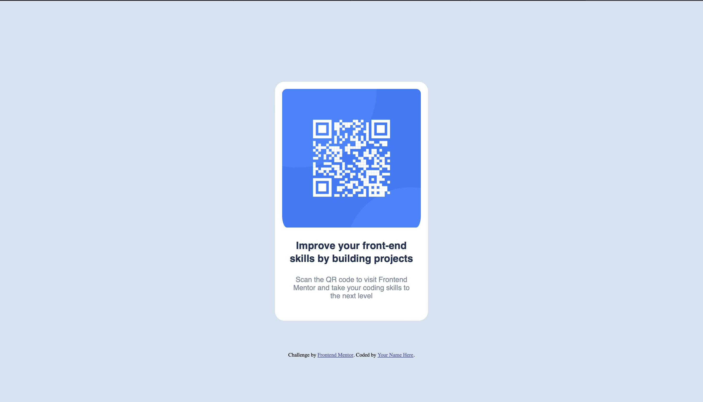

## Table of contents

- [Overview](#overview)
  - [Screenshot](#screenshot)
- [My process](#my-process)
  - [Built with](#built-with)
  - [What I learned](#what-i-learned)
- [Author](#author)
- [Acknowledgments](#acknowledgments)

## Overview

Simple QR code page

### Screenshot

## My process

  First, I started with the html code of the page, linking my css file, and changing the divs im going to use, then went to the css page to lay out the design of the static page.

### Built with

- Semantic HTML5 markup
- CSS custom properties

### What I learned

  I learned to set curved edges and placing the components in the right place by padding, margins, and positions.

## Author

- Frontend Mentor - [@kareemjabr99](https://www.frontendmentor.io/profile/kareemjabr99)

## Acknowledgments

   This was a fun little excersise to promote me to do bigger things in the future
